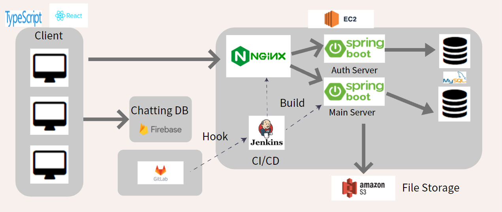
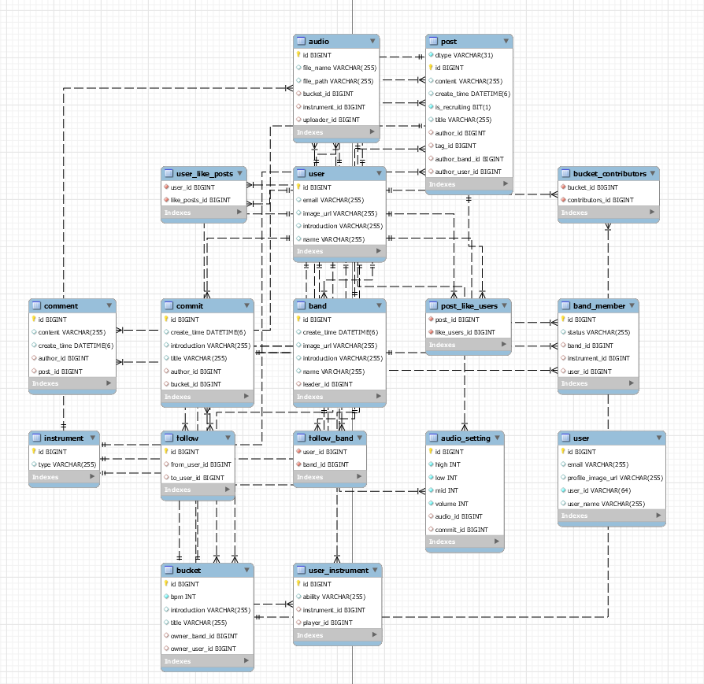
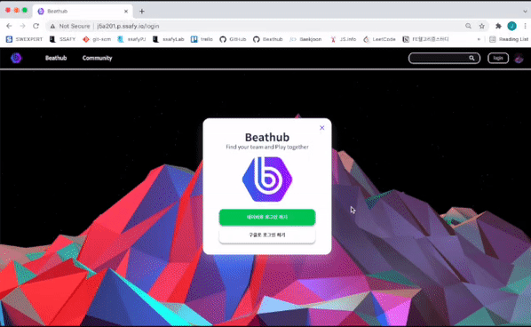
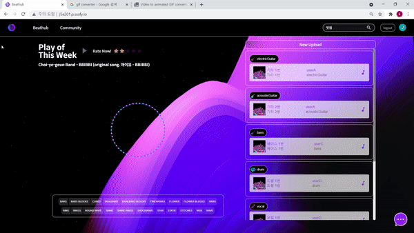
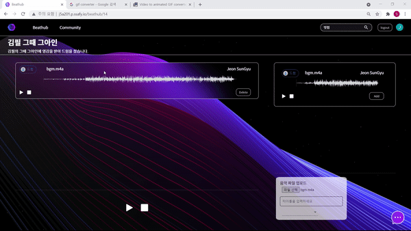
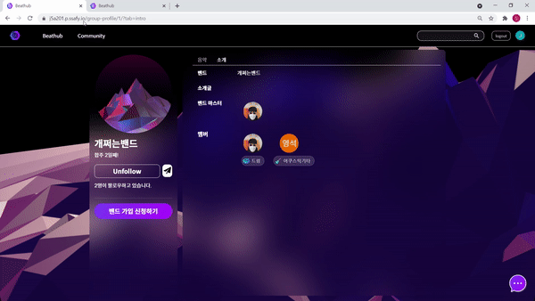
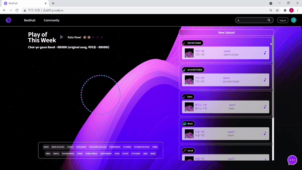

# Beathub

> 프론트엔드 : [김지윤](https://github.com/Helia-17), [서민수](https://github.com/tjatn304905), [전선규](https://github.com/sungyujeon)
>
> 백엔드 : [류영석](https://github.com/rhyuys115), [한상진](https://github.com/SangjinH)

## :information_desk_person: Introduction

- 기간 

  - 21.08.30 - 21.10.08 ( 6 weeks )

- 목적

  - 같이 소통하고, 나만의 음악 파일을 만들 수 있는 서비스를 구현했습니다.

- 내용

  - 나의 음악 `연주파일을 공유`하고, 다른 사람의 음악 파일에 맞춰 내가 연주하며

    `온라인으로도 합주`할 수 있는 경험을 제공하고자 하였고, 

    또한, 팀을 구할 수 있는 `커뮤니티를 구성해`,

    음악에 대한 `열정을 이어갈 수 있도록` 서비스를 만들었습니다.

## 🕋 Project Architecture

## 📚 Tech Stack

- **:art: Front-End**

  - Language
    -  

  - Framework / Library
    - 
  - Design
    -  
  - open API
    -   >> 

- :computer:  __Back-End__

  - Language
    -  
  - Framework / Library
    - 

- :house_with_garden: __Common__

  - Co-work

    -   

  - DevOps

    - 

  - Database

    -  

    

## 📂 Database Model

## 🎧 Service

### 메인 페이지

메인 페이지 입니다. 왼쪽부분에는 이 달의 음악이 추천으로 뜨고 오른쪽 부분에는 최근 업로드된 오디오 목록이 있습니다.

### 소셜 로그인

- 구글 로그인

해당 버튼을 누르게 되면 OAuth2와 연동되어 자동으로 저희 서비스에 회원 가입할 수 있습니다.

### Beathub

- 버킷 생성

  음악 파일을 업로드하고, 업로드한 파일들을 같이 재생해볼 수 있는 버킷을 생성합니다. 버킷의 제목과 설명을 입력하고, 합주를 시작해보세요.

- 음악 파일 업로드

  로컬에 있는 음악 파일을 버킷으로 업로드 할 수 있습니다. 업로드 시 파일명이 자동으로 타이틀이 되며, 이를 수정할 수 있습니다. 타이틀과 악기 카테고리를 선택하고 저장하면, 업로드한 음악 파일이 오른쪽 파일 목록에 등록됩니다.

- 음악 추가/삭제 및 재생

  합주할 음악 파일을 왼쪽 영역에 추가 및 삭제할 수 있습니다. Add 버튼을 눌러서 추가하고 Delete버튼을 눌러 삭제합니다. 개별 음악 파일은 재생, 일시정지, 정지, 탐색 기능이 지원하고 있으며, 전체 음악을 동시에 재생, 일시정지, 정지할 수도 있습니다.

### 커뮤니티

- 글 작성

  - 밴드가 팀원을 구하거나 개인이 밴드 팀을 구할 때 커뮤니티에 글을 남겨 홍보할 수 있습니다. 각각의 글에서 구인의 진행 상황을 체크할 수 있고, 댓글을 남길 수 있습니다. 글 목록 페이지에서는 제목이나 해당하는 악기를 선택해 검색할 수 있습니다.

- 밴드 가입 & 채팅

  
  
  - 밴드 가입을 위해 밴드장에게 DM을 보낼 수 있습니다. 개인별 채팅 기능을 제공하여 밴드에 가입하기 전에 서로의 정보를 교환할 수 있습니다.

### 프로필

- #### 개인 프로필

  

  - 프로필 조회

    프로필 사진, 닉네임, 자기소개, 연주 악기, 팔로워 및 팔로잉 수, 현재 활동하고 있는 밴드를 조회할 수 있습니다.

  - 버킷 조회

    생성한 버킷목록을 조회할 수 있습니다. 각각의 버킷을 클릭하면 버킷의 상세페이지로 이동하게 됩니다.

  - 프로필 수정

    본인의 프로필을 수정할 수 있습니다. Edit Profile을 클릭해 닉네임, 자기소개, 연주 악기를 수정합니다. 연주 악기 수정의 경우, 추가 버튼을 클릭하고 악기와 숙련도를 설정하여 악기를 추가할 수 있고, 이미 등록된 악기를 클릭해 삭제할 수 있습니다.

  - 팔로우/ DM

    타인의 프로필 페이지에서 팔로우 및 팔로우 취소를 신청할 수 있고, 채팅을 시작할 수 있습니다.

  - 밴드 생성

    밴드 목록 옆의 밴드생성 버튼을 클릭해서 새로운 밴드를 만들 수 있습니다. 생성 시 자신이 맡을 파트를 자신의 연주 악기 목록 중에서 선택합니다.

- #### 밴드 프로필

  

  - 프로필 조회

    프로필 사진, 밴드명, 밴드 소개, 멤버 목록, 팔로워 수를 조회할 수 있습니다. 멤버 목록에는 각각이 맡고 있는 파트가 보여집니다.

  - 버킷 조회

    생성한 버킷목록을 조회할 수 있습니다. 각각의 버킷을 클릭하면 버킷의 상세페이지로 이동하게 됩니다.

  - 프로필 수정

    밴드의 마스터인 경우, 밴드명, 밴드 소개를 수정할 수 있습니다.

  - 밴드 가입 신청 / 수락

    밴드를 가입하기 위해서 밴드 가입 신청을 할 수 있습니다. 밴드 마스터는 밴드원 관리 탭에서 신청목록을 조회하고 수락 및 거절을 할 수 있습니다.

  - 팔로우/ DM

    밴드 프로필 페이지에서 팔로우 및 팔로우 취소를 신청할 수 있고, 채팅을 시작할 수 있습니다. 이 경우에는 밴드 마스터에게 메세지가 보내집니다.
