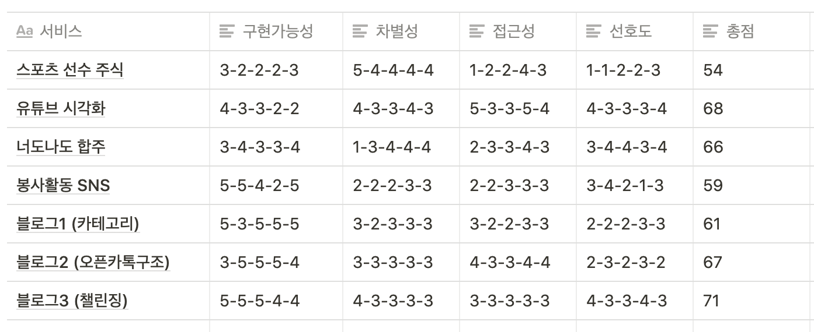

# A201

## 개요

- 특화 서울 2반 1조(A201)

- 트랙 : 빅데이터(분산처리)

- 팀장/팀원

  - 한상진(팀장)
  - 김지윤
  - 류영석
  - 서민서
  - 전선규

- 1주차 sub1 명세서

  - 기간 : 21. 8. 30.(월) ~ 21. 9. 3.(금)

  - 개인별 feature 브랜치 업로드
    (e.g. feature/myName)

<<<<<<< HEAD

## 공통사항 정하기

---

### 1. Git convention 정하기

> [basic]
>
> feat: 새로운 기능에 대한 커밋
>
> fix: 버그 수정에 대한 커밋
>
> chore: 그 외 자잘한 수정에 대한 커밋
>
> design: 디자인(레이아웃, css, 애니메이션 등) 변경에 대한 커밋
>
> docs: 문서 수정에 대한 커밋
>
> resolve: conflict 수정에 대한 내용
>
> comment: 필요한 주석 추가 및 변경
>
> [etc]
>
> hotfix: 급하게 치명적인 버그를 고치는 커밋
>
> build: 빌드 관련 파일 수정에 대한 커밋
>
> ci: CI관련 설정 수정에 대한 커밋
>
> style: 코드 스타일 혹은 포맷 등에 관한 커밋
>
> refactor: 코드 리팩토링에 대한 커밋
>
> test: 테스트 코드 수정에 대한 커밋
>
> git pull, merge 규칙 정해야..

### 2. 컨설턴트, 코치님과의 회의

> ## **210901(by 선규)**
>
> - 컨설턴트님의 원픽? 합주, 유튜브 기록은 광고영업자의 입장에서 해석하면 좋을 듯, 봉사활동은 반드시 봉사활동을 해야 하는 사람들에게 제공하는? 블로그도 나쁘지는 않다고 봄
> - 유튜브 기록 시각화
>   - 시청 데이터를 상관관계를 시각화해서 만드는 것 같은데
>   - 서비스 이용자는 어떤 목적으로 이 시각화된 데이터를 봐야할까?
>   - 이걸로 얻는 것이 무엇일지가 궁금
>   - 서비스, 솔루션을 이용하려면 목적이 있어야 하는데 > 타겟층이 어떤 이점이 있는지..
>   - 시각화 해서 보여주고 땡이면
>   - 이런 유튜버가 있으면 광고하시겠습니까? 이런 매개체가 될 수도 있는? 비지니스 모델을 생각해야 해, 그 역할을 내가 해주는 것인데, 추천은 어떻게 해주고 그 역할은 어떻게 할건지 고민해야돼
>   - 광고주와 유튜버를 연결해주는? 추천이나 통계에 의해서 뽑아주면 좋을듯?
>   - 내가 봤던걸 기준으로 하는데, 영업자의 입장에서 보면 또 더 찾아볼 수 있을 듯..
>   - 시청 기록을 가지고 시각화해서 보여주는건 보여주는거고, 메인 기능을 뭔가 장착했으면 좋겠음
>   - 키워드를 기반으로 해서 영상을 찾아내고, 조회수 찾아내고, 이 사람이 주로 다루는거 등등 분석해가지고 인사이트를 내서 필요한 업체에 제공하고..
> - 합주
>   - 합주를 해보면 멤버가 다 갖춰져 있는 경우도 있는데, 멤버를 못 구해서 힘들어하는 경우가 있음
>   - 우리 멤버가 되지는 않더라도, 누가 베이스 부분만 쳐주면 이 음악이 완성되니까 그걸 해줄 수 있는 사람을 구할 수 있는?
>   - 구해지지 않는 포지션을 누가 채워줄 수 있으면 좋겠다
>   - latency 때문에 같이 연주하는건 힘든데 입혀서 하면 좋음?
> - 블로그
>   - 왜 기능을 세개로 쪼개놨지? 고급 기능을 가진 블로그로 만들면 어떤가??
>   - 하나의 블로그 안에 들어갈 수 있지 않을까?
>   - 잘 만들어진 포털들의 블로그랑 비교를 당할텐데, 기존 블로그에서 다뤄지지 않은 부분들이 뭘지 티낼 것들을 만들어내야해
>   - 싸피라던지 개발자라던지 타겟팅을 해서 블로그 서비스를 만드는 것도 좋아
> - 정리
>   - 실효성, 고객이면 이걸 쓰겠다 안쓰겠다를 고민해봐야 해
>   - 유튜브가 이미 추천을 해주고 있는데, 유저가 이걸 굳이 쓰겠다? 라는 입장에서 생각해봐
>   - 봉사활동도 다른 데 검색하면 나오는데 굳이 이걸 쓰겠다? 라는 입장에서
>   - 기능인지 서비스인지 구분할 것
>   - `데이터가 없으면 수작업을 해서라도 만들어`
>
> ## **210902(정지환 코치님 회의)**
>
> - 온라인 합주실을 만들고 싶었음
> - eq - 이펙트 - 루프스테이션 넣자고 해서 다 넣음
> - 음원을 조절하기 위해 프론트쪽 공수가 엄청나게 큼
>   - js에서 음원을 필터 씌워서 변경을 할 수가 있는데 이것 자체는 배우기가 어려움
>   - 음원이 파형이 어떻게 이동하는지 등등을 배우는게 너무 힘들었음
>   - tonejs, pizzicato 프레임웤이 있었는데 그걸 사용함?
>     - tonejs 데모 프로젝트가 굉장히 많은데 이런 것도 할 수 있다를 보면 좋을 것 같음
>   - 여러 음원을 같이 재생하거나 재생했다 멈췄다 하는게 쉽지가 않았음. 이 채널을 관리해야 하는데 설명을 드리기가 어려움, exception 처리를 많이 했어야 함
>   - 녹음 같은건 외부에 만들어진 것을 사용함. vue, react 등에 녹음 기능이 있는 것을 사용했는데, 이걸 이용해서 마이크로 녹음했을 때 음원이 깨끗하게 넘어가지 않아서, 시연했던 것은 이미 녹음한 것을 업로드를 해서 진행함
>   - 마이크가 굉장히 좋으신 분이 있다면 녹음을 하는게 낫지 않나 싶음..
>   - 노트북을 이용해서는 깨끗하게 음원이 올라가지 않음

## 아이디어 회의(1주차)

- 서비스 기획 아이디어 취합 후 평가

  

- 최종 기획

  [<b>합주 서비스 플랫폼</b>]

  - 서비스 정의 : 오디오 기반의 합주 커뮤니티 서비스
  - 핵심기능
    - 밴드 합주(업로드 오디오 동시 재생)를 위한 기능
    - gitflow 방식 오디오 저장 및 시각화
    - 팀/개인별 업로드한 오디오 기반 밴드 구성원 구인
  - 진행상황
    - 서비스 기획 구체화 중
